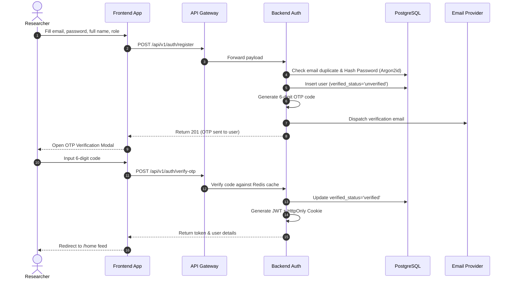
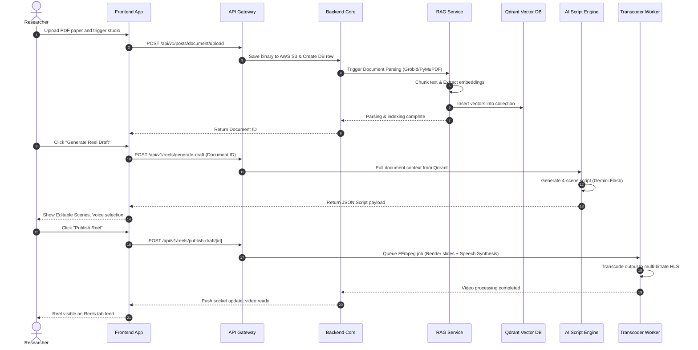

# ResearchReel V1.0 Enterprise — Master Product Architecture & Specification

This document provides a comprehensive, production-grade architectural design and product specification for **ResearchReel**, an academic research video collaboration platform. This blueprint is designed to scale to **1M+ researchers, professors, and students** and is implementation-ready.

---

## SECTION 1: PRODUCT ANALYSIS

### 1.1 Purpose & Mission
ResearchReel is a mobile-first academic collaboration platform designed to bridge the gap between complex academic research and public engagement. The mission is to democratize scholarly literature by translating dense research papers, datasets, and updates into digestible 30-60 second vertical video reels, combined with a collaborative research workspace, peer interactions, and AI-powered intelligence.

### 1.2 Problem Being Solved
1. **Academic Silo**: Traditional research papers are published in PDFs behind paywalls, making them inaccessible and dry to the general public, students, and interdisciplinary peers.
2. **Engagement Void**: Traditional social networks for academics (e.g., ResearchGate, Academia.edu) lack modern mobile engagement mechanics, vertical video playback, and real-time collaborative workspaces.
3. **Synthesis Overhead**: Scholars and students spend hours parsing and summarizing long academic papers. ResearchReel uses RAG (Retrieval-Augmented Generation) to streamline document understanding.

### 1.3 Target Users
* **Verified Researchers (Scholars/Professors)**: Require ORCID validation or institutional SSO. They publish research updates, upload papers, collaborate in workspaces, and verify content.
* **Students**: Verified via academic email domains or student ID uploads. They consume content, ask questions via AI, and join research project boards.
* **General Public**: Unverified guests who browse trending science posts, view reels, and engage with verified content.
* **Industry R&D Teams / Sponsors**: Monitor trending research fields, identify talent, and sponsor projects.

### 1.4 Business Goals & Competitors
* **Business Model**: SaaS subscription structure.
  * **Free**: Base feed access, 3 AI reel drafts/month, read-only workspaces.
  * **Pro ($29/month)**: Unlimited RAG queries, 15 AI-generated reels, active workspace participation.
  * **Business/Enterprise ($149+/month)**: Custom rendering queues, institution-wide seats, advanced analytics, and custom LLM model fine-tuning.
* **Competitors**: ResearchGate (strong database, weak UI/video/collaboration), Notion/Slack (strong workspace, no academic social discovery), TikTok/YouTube Shorts (strong engagement, zero peer review or citation validation).

### 1.5 SWOT & Technical Debt Analysis
* **Strengths**: Integrated RAG + vertical video automation, academic identity verification, multidimensional reactions (🤔 Interesting, 💡 Novel, ⚠️ Needs Discussion).
* **Weaknesses**: Burst-heavy GPU workloads for video transcoding and Whisper captions, cold-start community problem.
* **Technical Debt**: Current MVP (V0.1) relies on direct PostgreSQL queries without connection pooling middleware limits, lacks comprehensive audit logging, and contains partial mock routes for OAuth verification.
* **Future Opportunities**: Direct publication network API integrations (Springer, Elsevier, IEEE) to auto-import preprints and generate reels.

---

## SECTION 2: APPLICATION MAP

```text
ResearchReel App (Root Route `/`)
├── Landing Page (Unauthenticated /)
├── Auth Portal (`/auth`)
│   ├── Login (`/auth/login`)
│   ├── Register (`/auth/register`)
│   ├── OTP Verification (`/auth/verify`)
│   └── Forgot Password (`/auth/forget-password`)
├── Core Navigation Layout (Authenticated `/home`)
│   ├── Home Feed (`/home`)
│   │   ├── Post Detail Modal (`/home/post/[id]`)
│   │   └── Comment Drawer Component
│   ├── Reels Feed (`/reels`)
│   │   ├── Full-Screen vertical player overlay
│   │   └── Ask Paper AI Modal
│   ├── Creator Studio (`/create`)
│   │   ├── Document Uploader (`/create/upload`)
│   │   └── Reel Script & Slide Editor (`/editor/[draft_id]`)
│   │       └── Voice & Automation Settings (`/reels/automation`)
│   ├── Messages Hub (`/messages`)
│   │   ├── Conversation Detail Layout (`/messages/[id]`)
│   │   └── Dataset/File Sharing Drawer
│   ├── Explore Portal (`/explore`)
│   │   ├── Conference Track Trackers (`/explore/conference/[id]`)
│   │   └── Search & Discovery Grid (`/search`)
│   ├── Collaboration Workspace (`/projects`)
│   │   └── Workspace Panel (`/workspace/[id]`)
│   │       ├── Kanban Project Board Component
│   │       ├── Interactive Document Reader (`/document/[id]`)
│   │       │   └── Ask Claude Floating Action Button (FAB)
│   │       └── Document Version Diff Panel
│   ├── Leaderboards (`/leaderboard`)
│   ├── Achievements Dashboard (`/achievements`)
│   └── User Profiles (`/profile/[id]`)
│       ├── Profile Settings Dashboard (`/profile/settings`)
│       ├── ORCID Callback Handler (`/auth/verify/orcid`)
│       └── Student Verification Console
└── Admin Portal (`/mod`)
    ├── Reports Queue Dashboard
    ├── User Verification Dashboard
    ├── System Logs & Health Inspector
    └── Feature Flag Console
```

---

## SECTION 3: PAGE ANALYSIS

### 3.1 Primary Navigation & Base Layout
* **Layout**: Fixed responsive shell.
  * **Desktop**: Left vertical sidebar (72px collapsed, 240px expanded), central scroll column (600px width), right widgets sidebar (340px width).
  * **Tablet**: Left vertical icon-only sidebar (72px), central scroll column (100% remaining width).
  * **Mobile**: Bottom glassmorphic navigation bar (5 buttons: Home, Reels, Create, Messages, Profile), top bar containing Logo, Notification Bell icon (red badge count), Search icon.
* **Theme System**: Compliant with Apple Human Interface Guidelines (HIG).
  * **Light Mode**: Pure White background (`#FFFFFF`), Text (`#000000`), iOS Blue Accent (`#007AFF`), Subtle Borders (`rgba(0,0,0,0.12)`).
  * **Dark Mode**: OLED Black background (`#000000`), Text (`#FFFFFF`), Slate Borders (`rgba(255,255,255,0.12)`).
* **SEO Metadata**: Static metadata with dynamic hooks for post-specific paths.
  ```json
  {
    "title": "ResearchReel - Academic Video Collaboration Network",
    "description": "Transform research papers into short-form reels, collaborate with global scholars, and chat with AI assistants.",
    "og:type": "website",
    "robots": "index, follow"
  }
  ```

### 3.2 Individual Page Breakdown

#### 3.2.1 Home Feed (`/home`)
* **Purpose**: Primary scrollable interface displaying text, image, and document updates from followed researchers.
* **Layout**: Multi-column responsive layout. Main feed is centered.
* **Key Components**:
  * **Composer Card**: Text area (2000 chars), image attachments button, document uploader button, DOI search input field, and Submit button.
  * **Academic Post Cards**: Header with profile thumbnail, researcher tier badge, timestamp, post content (Markdown & LaTeX math rendering), attachments container, reaction bar (🤔 Interesting, 💡 Novel, ⚠️ Needs Discussion), Comment trigger button, and Bookmark icon.
  * **Comment Drawer**: Slides from right on desktop, slides up on mobile. Scrollable list of comment cards containing text, LaTeX equations, and reply buttons.
* **Keyboard Shortcuts**: `J` (Next Post), `K` (Previous Post), `L` (Like/React first option), `C` (Open Comments), `B` (Bookmark).

#### 3.2.2 Reels Feed (`/reels`)
* **Purpose**: Full-screen, immersive 9:16 vertical video player scroll.
* **Layout**: Fixed full viewport.
* **Key Components**:
  * **Video Player**: HLS streaming (`video.js`/native player integration) with auto-play, loop, mute state.
  * **Left Overlay**: Researcher name, verified credential badge, expandable video description (truncated to 100 characters with a "more" button), tags list (e.g. `#Neuroscience`), and interactive timestamps (e.g. `0:15 - Fig 2`).
  * **Right Overlay (Vertical Stack)**: Profile photo, Reaction counts, Comments button (opens bottom drawer), Share button, Paper link button (direct link to PDF reader page), and Sound track icon.
  * **Ask Paper AI FAB**: Tapping opens a RAG chat modal focused on the current reel's attached paper.

#### 3.2.3 Document Reader & Workspace (`/document/[id]`)
* **Purpose**: Split-screen PDF reader and collaboration suite.
* **Layout**:
  * **Desktop**: Left panel showing PDF renderer page-by-page. Right panel showing tabs: Annotations, Chat, Version History, Authorship Analytics.
  * **Mobile/Tablet**: Single viewport with toggle tabs (Document vs. Chat).
* **Key Components**:
  * **PDF Viewer**: High-speed canvas rendering, page jump control, zoom buttons.
  * **Ask Claude FAB**: Drag-and-drop floating action button. Tapping opens a sidebar chat panel with pre-prompted LLM context on the paper's contents.
  * **Annotation Tool**: Highlight tool, sticky note creator, freehand pen tool.
  * **Version History Panel**: List of card revisions showing date, author name, change summary, and a "Compare Diff" toggle.

---

## SECTION 4: BUTTON BEHAVIOR

| Element ID | Page Context | Purpose | Permissions | Validation Rules | Success State & DB Mutation | Failure State & Toast | Redirect / Modal | Analytics Event |
| :--- | :--- | :--- | :--- | :--- | :--- | :--- | :--- | :--- |
| `btn-login-submit` | `/auth/login` | Authenticate user credentials | Guest | Email must be valid; password length >= 8 | Set HttpOnly cookie; redirect `/home` | HTTP 401: "Invalid email/password" | Redirects to `/home` | `user_login_success` |
| `btn-register-submit` | `/auth/register` | Create account entry | Guest | Strong password checks, valid email formats | Create unverified user row; send OTP | HTTP 409: "Email already registered" | Opens OTP Verification modal | `user_registration_started` |
| `btn-verify-otp` | `/auth/verify` | Verify 6-digit email OTP code | Guest | OTP must be 6 digits, numerical | Update user verified status in `users` | HTTP 400: "Invalid or expired OTP code" | Redirects to `/home` | `user_email_verified` |
| `btn-react-interesting` | `/home` | Mark post as Interesting | Viewer+ | None | Insert/Delete row in `reactions` table | HTTP 500: "Failed to record reaction" | Updates reaction count UI | `post_reaction_interesting` |
| `btn-ask-gemini-fab` | `/document/[id]` | Query AI about the PDF | Student+ | Prompt text must not be empty | Call `/api/v1/ai/ask-gemini`; deduct quota | HTTP 429: "Usage quota exceeded" | Opens AI Sidebar Drawer | `ai_rag_query_sent` |
| `btn-generate-draft` | `/create` | Launch AI script-to-reel pipeline | Scholar+ | Attached document must be parsed | Create entry in `reel_drafts` with status `draft` | HTTP 500: "AI worker timed out" | Redirects to `/editor/[draft_id]` | `ai_reel_draft_generated` |
| `btn-publish-draft` | `/editor/[id]` | Finalize draft and transcode video | Creator | Scenes list must not be empty | Set draft `status='published'`, write to `videos` | HTTP 400: "Audio rendering failure" | Redirects to `/reels` | `reel_published_success` |
| `btn-update-task` | `/workspace/[id]` | Update Kanban task status | Member | Task must exist, target status must be valid | Update task row status in MongoDB | HTTP 403: "Permission denied" | Moves task card UI element | `kanban_task_updated` |
| `btn-orcid-link` | `/profile/settings` | Link academic ORCID account | Researcher | Valid OAuth state | Update ORCID field and set tier status to `scholar` | HTTP 400: "ORCID callback invalid" | Redirects to `/profile` | `orcid_verified_success` |
| `btn-checkout-pro` | `/profile/settings` | Upgrade to Pro tier | Student+ | None | Initiates Stripe checkout session | HTTP 500: "Stripe interface offline" | Redirects to Stripe hosted page | `billing_checkout_started` |

---

## SECTION 5: PAGE STATES

### 5.1 Base Interface States
1. **Loading State**: A semi-transparent overlay blocking interactions, displaying a spinning loading indicator.
2. **Skeleton State**: Grey shimmering layout blocks mimicking the shape of the component (e.g. feed card, user profile header) while assets load.
3. **Empty State**: An illustration, a headline (e.g., "No papers uploaded yet"), and a Call-To-Action (CTA) button to trigger the missing action.
4. **No Internet State**: A full-screen overlay showing a disconnected cable icon with the message "No Internet connection detected. Checking network status..." and automatic polling retry logic.
5. **API Timeout State**: A top alert banner saying "Server took too long to respond. Please check your connection and retry." with a refresh button.

### 5.2 Exception & Operational States
1. **Permission Denied (403)**: A flat screen stating "Faculty Verification Required. The page you are trying to access is restricted to verified academics." with a button to upload ORCID credentials.
2. **Not Found (404)**: Clean visual page containing a search bar and a link directing back to `/home`.
3. **Server Error (500)**: Clean card showing "Something went wrong on our end. Our engineering team has been notified. Request ID: `rr-xxx-xxx`".
4. **Validation Error**: Red outlines around invalid fields with helper messages detailing the required formats (e.g. "ORCID must follow format 0000-0000-0000-0000").
5. **Rate Limited (429)**: Warning dialog displaying: "Too many AI generations requested. Standard quotas reset in 14 minutes." and options to upgrade to Pro.

---

## SECTION 6: USER FLOWS





---

## SECTION 7: AI WORKFLOW

### 7.1 RAG Pipeline (Academic Paper Understanding)
1. **Document Parsing**: FastAPI service running PyMuPDF and Grobid extracts headers, paragraphs, figures references, and bibliographic references from uploaded PDFs.
2. **Text Chunking**: Paragraphs are chunked using recursive character separation with a maximum chunk size of 800 tokens and 100 tokens overlap, preserving chapter context.
3. **Embedding Generation**: Text chunks are passed through the `text-embedding-3-large` API to generate 1536-dimensional float vectors.
4. **Vector Storage**: Vectors are loaded into the Qdrant DB, tagged with `document_id`, `uploader_id`, and `section_header` payload keys.
5. **Retriever**: Queries are transformed into vectors and matched against Qdrant using Cosine similarity. Top-K (K=5) chunks are passed to the Gemini 3.5 Flash LLM context window.

### 7.2 AI Content Studio (Script & Video Reel Generation)
* **Script Synthesizer**: Uses Gemini 3.5 Flash with structured output schemas to output JSON containing:
  * **Intro Scene**: Hook, research title, target audience matching.
  * **Problem Scene**: Current limitations, visually mapped to paper background.
  * **Methodology Scene**: Novel methodology, reference to figures/equations.
  * **Results Scene**: Data outcomes, chart visualizations, key conclusions.
* **Text-To-Speech (TTS)**: Translates script lines to audio files using Edge-TTS models, allowing selection of student-friendly, professional, and regional accents.
* **Video Rendering Engine**:
  * An asynchronous Python worker receives the scene layout JSON and TTS files.
  * Captions are parsed into WebVTT subtitle formatting.
  * FFmpeg runs image stitching and overlay pipelines to render a 1080x1920 (9:16) MP4 video with a length constrained to 30-60 seconds.
* **Cost Optimization & Caching**: RAG queries are cached using Redis semantic cache (similarity checking using embeddings of questions). Fallback models (Ollama running Mistral 7B) are engaged if Gemini rate limits or quota boundaries are reached.

---

## SECTION 8: DATABASE DESIGN

```sql
-- PostgreSQL DDL for ResearchReel V1.0 Enterprise

CREATE EXTENSION IF NOT EXISTS "uuid-ossp";

CREATE TABLE IF NOT EXISTS institutions (
  id UUID PRIMARY KEY DEFAULT uuid_generate_v4(),
  name VARCHAR(255) NOT NULL,
  domain VARCHAR(255) UNIQUE,
  logo_url TEXT,
  created_at TIMESTAMP DEFAULT CURRENT_TIMESTAMP
);

CREATE TABLE IF NOT EXISTS users (
  id UUID PRIMARY KEY DEFAULT uuid_generate_v4(),
  email VARCHAR(255) UNIQUE NOT NULL,
  username VARCHAR(50) UNIQUE NOT NULL,
  password_hash TEXT NOT NULL,
  full_name VARCHAR(100),
  bio TEXT,
  profile_picture_url TEXT,
  verification_status VARCHAR(20) DEFAULT 'unverified', -- 'unverified', 'student', 'scholar', 'faculty', 'admin'
  orcid_id VARCHAR(19) UNIQUE,
  institution_id UUID REFERENCES institutions(id) ON DELETE SET NULL,
  research_interests TEXT[],
  stripe_customer_id VARCHAR(100) UNIQUE,
  subscription_tier VARCHAR(20) DEFAULT 'free', -- 'free', 'pro', 'business', 'enterprise'
  created_at TIMESTAMP DEFAULT CURRENT_TIMESTAMP,
  last_active TIMESTAMP,
  is_deleted BOOLEAN DEFAULT FALSE
);

CREATE TABLE IF NOT EXISTS documents (
  id UUID PRIMARY KEY DEFAULT uuid_generate_v4(),
  uploader_id UUID REFERENCES users(id) ON DELETE CASCADE,
  file_name VARCHAR(255) NOT NULL,
  file_type VARCHAR(50),
  file_url TEXT NOT NULL,
  summary_text TEXT,
  key_points TEXT[],
  is_verified BOOLEAN DEFAULT FALSE,
  created_at TIMESTAMP DEFAULT CURRENT_TIMESTAMP
);

CREATE TABLE IF NOT EXISTS posts (
  id UUID PRIMARY KEY DEFAULT uuid_generate_v4(),
  author_id UUID REFERENCES users(id) ON DELETE CASCADE,
  content_type VARCHAR(20) NOT NULL, -- 'text', 'image', 'document', 'video'
  caption TEXT,
  media_urls TEXT[],
  document_id UUID REFERENCES documents(id) ON DELETE SET NULL,
  tags TEXT[],
  publication_status VARCHAR(20) DEFAULT 'wip', -- 'preprint', 'published', 'wip'
  doi VARCHAR(255),
  moderation_status VARCHAR(20) DEFAULT 'approved', -- 'pending', 'approved', 'flagged', 'hidden'
  created_at TIMESTAMP DEFAULT CURRENT_TIMESTAMP,
  updated_at TIMESTAMP DEFAULT CURRENT_TIMESTAMP,
  is_deleted BOOLEAN DEFAULT FALSE
);

CREATE TABLE IF NOT EXISTS videos (
  id UUID PRIMARY KEY DEFAULT uuid_generate_v4(),
  author_id UUID REFERENCES users(id) ON DELETE CASCADE,
  title VARCHAR(200) NOT NULL,
  description TEXT,
  video_url TEXT NOT NULL,
  hls_playlist_url TEXT,
  thumbnail_url TEXT,
  duration_seconds INT CHECK (duration_seconds BETWEEN 30 AND 60),
  linked_paper_id UUID REFERENCES documents(id) ON DELETE SET NULL,
  timestamps JSONB,
  tags TEXT[],
  created_at TIMESTAMP DEFAULT CURRENT_TIMESTAMP
);

CREATE TABLE IF NOT EXISTS reactions (
  id UUID PRIMARY KEY DEFAULT uuid_generate_v4(),
  post_id UUID REFERENCES posts(id) ON DELETE CASCADE,
  user_id UUID REFERENCES users(id) ON DELETE CASCADE,
  reaction_type VARCHAR(20) NOT NULL, -- 'interesting', 'novel', 'needs_discussion'
  created_at TIMESTAMP DEFAULT CURRENT_TIMESTAMP,
  CONSTRAINT unique_user_post_reaction UNIQUE (user_id, post_id)
);

CREATE TABLE IF NOT EXISTS follows (
  follower_id UUID REFERENCES users(id) ON DELETE CASCADE,
  following_id UUID REFERENCES users(id) ON DELETE CASCADE,
  created_at TIMESTAMP DEFAULT CURRENT_TIMESTAMP,
  PRIMARY KEY (follower_id, following_id)
);

CREATE TABLE IF NOT EXISTS moderation_reports (
  id UUID PRIMARY KEY DEFAULT uuid_generate_v4(),
  reporter_id UUID REFERENCES users(id) ON DELETE SET NULL,
  target_type VARCHAR(20) NOT NULL, -- 'post', 'comment', 'video', 'user'
  target_id UUID NOT NULL,
  reason TEXT NOT NULL,
  status VARCHAR(20) DEFAULT 'pending', -- 'pending', 'under_review', 'resolved', 'dismissed'
  reviewer_id UUID REFERENCES users(id) ON DELETE SET NULL,
  reviewer_notes TEXT,
  created_at TIMESTAMP DEFAULT CURRENT_TIMESTAMP
);

CREATE TABLE IF NOT EXISTS audit_logs (
  id UUID PRIMARY KEY DEFAULT uuid_generate_v4(),
  actor_id UUID REFERENCES users(id) ON DELETE SET NULL,
  action VARCHAR(100) NOT NULL,
  target_type VARCHAR(50),
  target_id UUID,
  ip_address VARCHAR(45),
  metadata JSONB,
  created_at TIMESTAMP DEFAULT CURRENT_TIMESTAMP
);

-- Indexes for performance scale
CREATE INDEX idx_users_email ON users(email);
CREATE INDEX idx_posts_author ON posts(author_id) WHERE is_deleted = FALSE;
CREATE INDEX idx_posts_created ON posts(created_at DESC);
CREATE INDEX idx_videos_author ON videos(author_id);
CREATE INDEX idx_reactions_post ON reactions(post_id);
CREATE INDEX idx_audit_logs_actor ON audit_logs(actor_id);
```

### 8.1 NoSQL & Graph Schemas
* **MongoDB Workspace Collections**:
  * `workspaces`: `{ id, title, ownerId, members: [{ userId, role }], createdAt }`
  * `kanban_cards`: `{ id, workspaceId, title, desc, status: "todo"|"in_progress"|"done", assigneeId, dueDate }`
  * `document_revisions`: `{ id, docId, version, textContent, editorId, commitMsg, timestamp }`
* **Neo4j Graph Database Schema (Citations Network)**:
  * Nodes: `(p:Paper {doi: "10.1038/...", title: "...", publisher: "..."})`
  * Nodes: `(a:Author {orcid: "...", name: "..."})`
  * Edges: `(p1)-[:CITES {sentiment: "supports"|"contradicts"|"neutral", contextText: "..."}]->(p2)`
  * Edges: `(a)-[:AUTHORED]->(p)`

---

## SECTION 9: BACKEND API CONTRACTS

### 9.1 Authentication & Registration (`/api/v1/auth`)
* **`POST /api/v1/auth/register`**
  * **Purpose**: Enroll new user accounts.
  * **Request Body**: `{ "email": "user@university.edu", "username": "academicUser", "password": "SecurePassword123", "role": "student" }`
  * **Response (201)**: `{ "success": true, "message": "Verification OTP sent successfully" }`
  * **Errors**: `400 Bad Request` (Validation errors), `409 Conflict` (Duplicate email/username).
  * **Rate Limit**: 5 per IP / hour.
* **`POST /api/v1/auth/verify-otp`**
  * **Request Body**: `{ "email": "user@university.edu", "otp": "123456" }`
  * **Response (200)**: `{ "success": true, "token": "jwt.header.payload.signature", "user": { "id": "uuid", "email": "user@university.edu", "role": "student" } }`
  * **Errors**: `400 Bad Request` (Invalid/expired OTP).
  * **Rate Limit**: 10 per IP / 15 min.

### 9.2 Reels Studio API (`/api/v1/reels`)
* **`POST /api/v1/reels/generate-draft`**
  * **Auth**: JWT Required
  * **Request Body**: `{ "document_id": "document-uuid-here", "difficulty": "layman"|"undergrad"|"expert" }`
  * **Response (200)**:
    ```json
    {
      "draft_id": "draft-uuid",
      "title": "Quantum Computing Summarized",
      "scenes": [
        { "number": 1, "text": "Welcome to Quantum Physics 101.", "audio_accent": "us-male" },
        { "number": 2, "text": "This paper highlights qubit superposition.", "audio_accent": "us-male" }
      ]
    }
    ```
* **`POST /api/v1/reels/publish-draft/:id`**
  * **Auth**: JWT Required
  * **Response (202)**: `{ "success": true, "message": "Video rendering queued", "job_id": "job-uuid" }`

### 9.3 RAG Chat API (`/api/v1/ai`)
* **`POST /api/v1/ai/ask-gemini`**
  * **Auth**: JWT Required
  * **Request Body**: `{ "document_id": "document-uuid", "question": "What is the core findings in Figure 4?" }`
  * **Response (200)**: `{ "answer": "Figure 4 shows a 12% increase in coherence times when utilizing cryogenic shields...", "sources": [{ "page": 4, "snippet": "..." }] }`
  * **Rate Limit**: 20 requests per hour. Caches exact questions using Redis Cache.

---

## SECTION 10: FRONTEND ARCHITECTURE

### 10.1 Component Tree & File Structure
```text
frontend/src/
├── app/
│   ├── layout.tsx                # App shell, AuthContext provider, Theme layout wrapper
│   ├── page.tsx                  # Landing landing portal layout
│   ├── home/
│   │   └── page.tsx              # Central scrollable feed layout
│   ├── reels/
│   │   └── page.tsx              # Immersive vertical video feed
│   ├── workspace/
│   │   └── [id]/
│   │       └── page.tsx          # Kanban & split PDF board
│   └── globals.css               # Apple HIG styles, custom scrollbars, animations
├── components/
│   ├── FeedCard.tsx              # Renders Markdown & KaTeX equations
│   ├── VideoPlayer.tsx           # VideoJS-backed HLS responsive player
│   └── RAGChatDrawer.tsx         # Sidebar chat module for doc Q&A
└── context/
    └── AuthContext.tsx           # Global state holding token, active user schema, loading
```

### 10.2 Global State & Performance Architecture
* **State Manager**: Context API is used for simple session-wide settings (`AuthContext`). SWR/React Query handles all fetching, caching, pre-fetching next posts, and stale-while-revalidate synchronization.
* **Lazy Loading**: Route-level dynamic loading of bulky sub-components (e.g. `RAGChatDrawer`, `LaTeXEditor`) reduces initial JS bundle size.
* **Accessibility (WCAG 2.1)**: Elements have `aria-label` tags, contrast matches 4.5:1 ratio, keyboard-traps are bypassed in drawers, and focus outlines match the Apple system layout guidelines.

---

## SECTION 11: SECURITY

* **Authentication (JWT)**: Auth tokens are delivered inside secure `HttpOnly`, `SameSite=Strict`, `Secure` cookies to completely block Cross-Site Scripting (XSS) extraction vectors.
* **Authorization**: RBAC checks are verified both on client routes (via Next.js Middleware) and API handlers (Express `checkRole` module). Roles hierarchy: `guest` -> `viewer` -> `student` -> `scholar` -> `moderator` -> `admin`.
* **Input Sanitization & Injection Defense**:
  * All database queries run through Postgres parameterized binding to prevent SQL Injection.
  * Express API server uses `express-clean-html` to sanitize text bodies, blocking stored XSS vectors.
  * `Helmet` headers block Clickjacking (via `X-Frame-Options`) and restrict inline scripts.
* **File Upload Protections**:
  * Uploads to S3 run via pre-signed URLs to keep credentials secure.
  * Files are verified using MIME-type header checks and restricted to `.pdf`, `.docx`, `.png`, `.jpg`, `.mp4`.
  * Upload queues pass buffers to ClamAV microservice containers before publishing to the CDN buckets.

---

## SECTION 12: ADMIN PANEL

* **Structure**: Split administration hub located at `/mod`, restricted to users with role `admin` or `moderator`.
* **Sub-Modules**:
  1. **Moderation Queue**: Sorted listing of reports from `moderation_reports`. Buttons let admins resolve (hide post, block content) or dismiss reports, creating audit trail entries.
  2. **User Verifications**: Dashboard showing student verification emails and ORCID submissions. Admins can review attachments and manually upgrade verified tiers.
  3. **System Logs**: Streams system log entries, filtering by level (`error`, `warn`) and module (`auth`, `ai`, `billing`).
  4. **System Health Console**: Displaying Kubernetes replicas count, CPU/Memory metrics, database connection pool statistics, and Kafka consumer lags.

---

## SECTION 13: NOTIFICATIONS

* **Engine**: Node.js microservice utilizing **BullMQ** backed by Redis for scheduling.
* **Delivery Pathways**:
  * **In-App**: Real-time push events powered by Socket.io, displayed via toast banners.
  * **Push**: Firebase Cloud Messaging (FCM) pushes notifications to iOS and Android applications.
  * **Email**: Nodemailer integrates with SES/SendGrid to transmit digest notifications or security verifications.
* **Subscription Preference Layout**: User settings row defining active channels for:
  * Likes / Reactions (Digest only)
  * Workspace updates / Kanban assignments (Instant In-app & Email)
  * New Follower notifications (Push only)

---

## SECTION 14: BILLING

* **Integration**: Stripe-driven customer portal integration.
* **Tiers & Quota Management**:
  * **Free**: $0. 3 AI Reel Generations. 50MB Workspace storage.
  * **Pro**: $29/mo. 25 AI Reel Generations. 2GB Workspace storage.
  * **Enterprise**: Custom pricing. Unlimited generations. Dedicated GPU nodes.
* **Usage Ingestion**: On successful AI reel creation or vector processing, backend updates Stripe usage records. Stripe Webhooks listen to `invoice.paid`, updating membership statuses in the `users` table.

---

## SECTION 15: ANALYTICS

* **Implementation**: Telemetry data is pushed to a Kafka topic `user-telemetry`, which ClickHouse aggregates.
* **Core KPIs Traced**:
  * **Active Telemetry**: Video watch retention curves (analyzing drop-off rates in reels).
  * **Product Funnel**: Registration -> OTP verify -> First PDF Upload -> First Reel Publish.
  * **AI Cost Monitoring**: Tracking prompt tokens, completions tokens, and total image/audio assets generation costs per user.

---

## SECTION 16: ERROR HANDLING MATRIX

| Error Code | API Context | User Interface Display Copy | Retry / Recovery Workflow |
| :--- | :--- | :--- | :--- |
| `ERR_AUTH_EXPIRED` | API Request | "Session expired. Please log in again to continue." | Redirect user to `/auth/login` |
| `ERR_RAG_LIMIT_EXCEEDED` | `/api/v1/ai/ask-gemini` | "Daily query limit reached. Upgrade to Pro for unlimited access." | Open Upgrade Modal checkout |
| `ERR_TRANSCODING_FAILED` | Reels Processing | "Video generation failed. Please check script formatting and try again." | Re-enable script editor controls |
| `ERR_PAYMENT_DECLINED` | Stripe Checkout | "Payment declined. Please update billing credentials and retry." | Re-open Stripe checkout view |
| `ERR_NETWORK_DISCONNECTED` | Global Network | "Network offline. Reconnecting in 3s..." | Continuous polling; reconnect sockets |
| `ERR_FILE_TOO_LARGE` | Document Upload | "PDF size exceeds 50MB. Please compress or crop the file." | Clear file picker element state |

---

## SECTION 17: TESTING STRATEGY

### 17.1 Unit & Integration Testing
* **Backend Tests (Jest + Supertest)**: Verify controllers, validation middleware, and auth paths. Database queries are mocked using transaction-based rollbacks.
* **Frontend Tests (React Testing Library)**: Ensure components render correct accessibility tags and transitions. Mock API requests via MSW (Mock Service Worker).

### 17.2 End-To-End (Playwright)
* **Verify Core Journey**: Auto-simulate registration, code OTP validation, document upload, reel generator studio launch, scene editor interaction, and final publication rendering check.

---

## SECTION 18: DEPLOYMENT

```yaml
# Kubernetes Manifest Sample - API Gateway Deployment (k8s/gateway-deployment.yml)
apiVersion: apps/v1
kind: Deployment
metadata:
  name: api-gateway
  namespace: researchreel
spec:
  replicas: 3
  selector:
    matchLabels:
      app: api-gateway
  template:
    metadata:
      labels:
        app: api-gateway
    spec:
      containers:
      - name: api-gateway-app
        image: ghcr.io/goldypahal/researchreel/api-gateway:latest
        ports:
        - containerPort: 5000
        envFrom:
        - secretRef:
            name: researchreel-secrets
        resources:
          limits:
            cpu: "1"
            memory: "1Gi"
          requests:
            cpu: "500m"
            memory: "512Mi"
        readinessProbe:
          httpGet:
            path: /api/v1/health
            port: 5000
          initialDelaySeconds: 10
          periodSeconds: 5
```

### 18.1 Continuous Integration & Delivery
* **GitHub Actions Workflow**:
  * On every pull request: Run ESLint, Jest backend, next-build frontend, and dependency scans.
  * On merge to `main`: Build multi-stage optimized Docker containers, push to Github Container Registry (GHCR), and run rolling updates via `kubectl set image`.

---

## SECTION 19: FUTURE FEATURE ROADMAP

* **AI Citation Networks Graph (Rank: Critical)**: Visual interactive Neo4j citation link explorer. Allows research analysis to see contradicting or supporting papers. (Effort: Medium, Value: High, Complexity: High).
* **Multi-Language Video Voiceovers (Rank: High)**: Localized speech translation overlays for reels using neural AI voices. (Effort: High, Value: High, Complexity: Medium).
* **Automated Peer-Review Matching (Rank: Medium)**: Matches authors with prospective peer reviewers based on research interests and past publication lists. (Effort: Low, Value: Medium, Complexity: Low).
