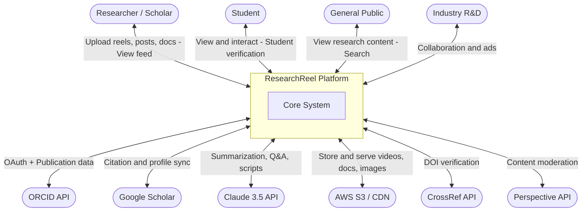
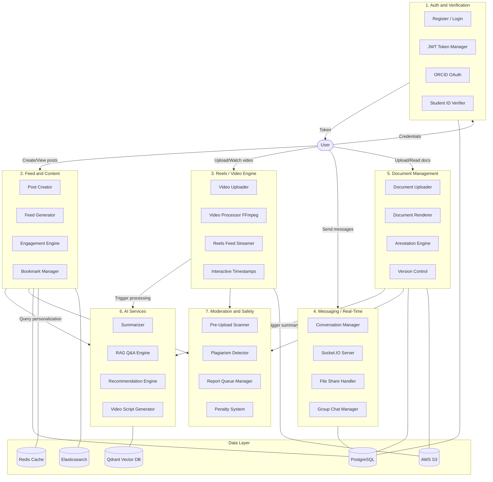
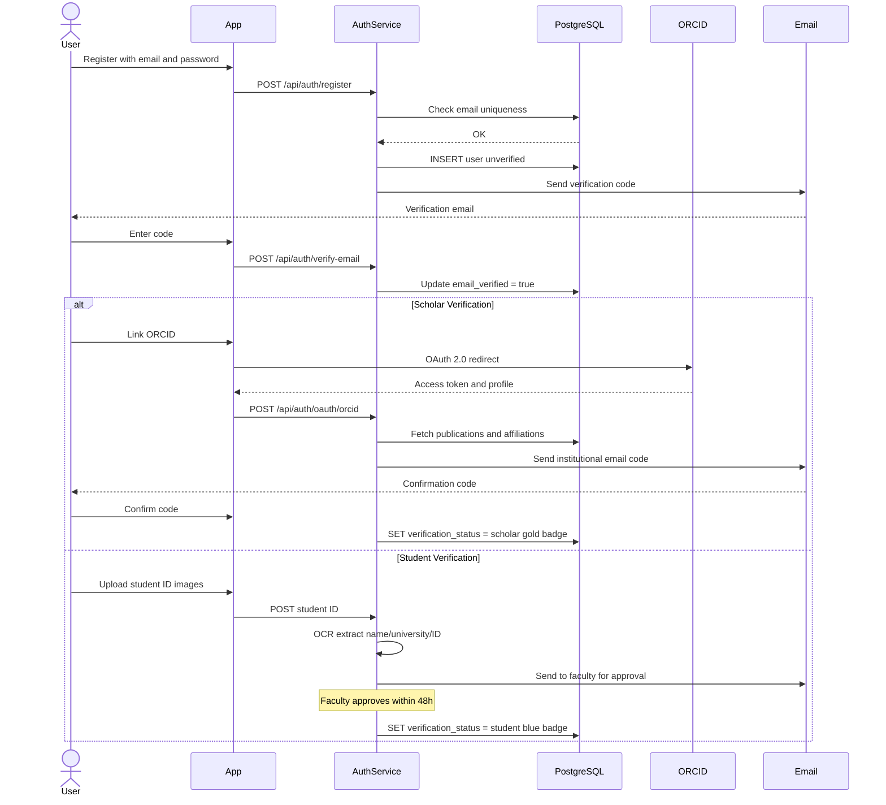
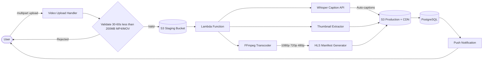
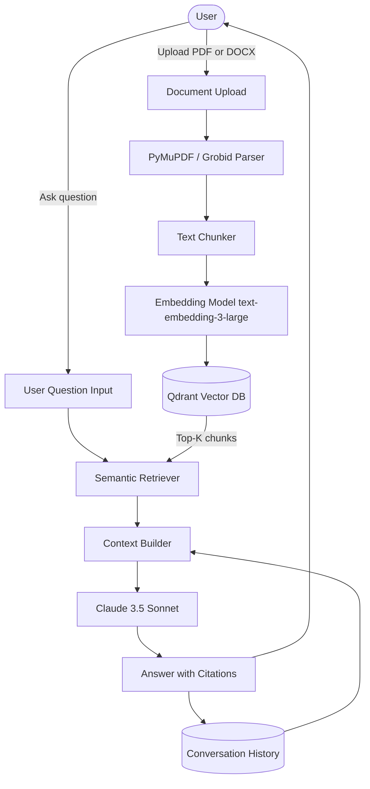
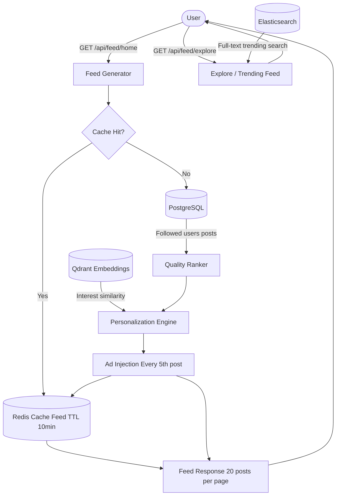
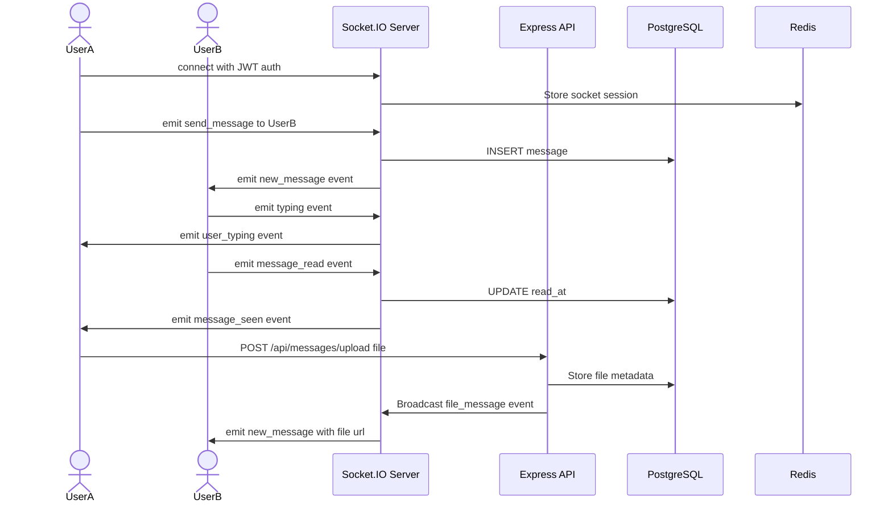
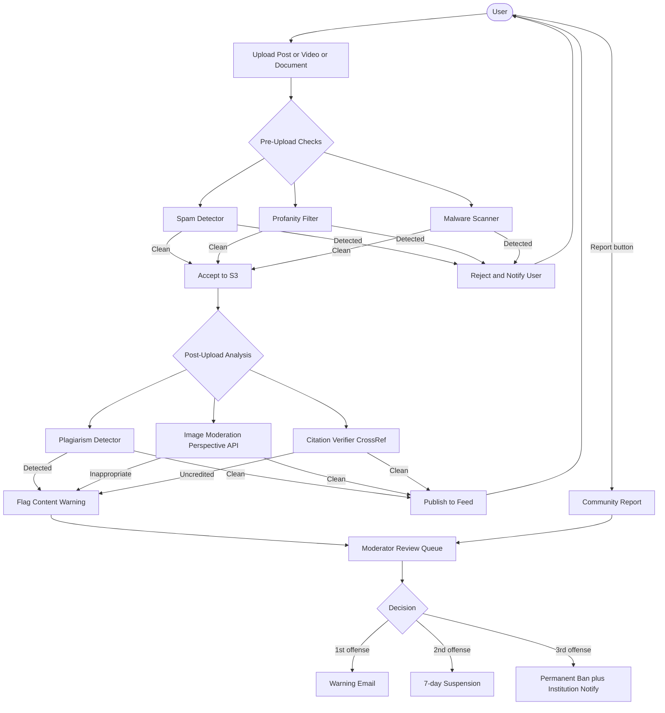
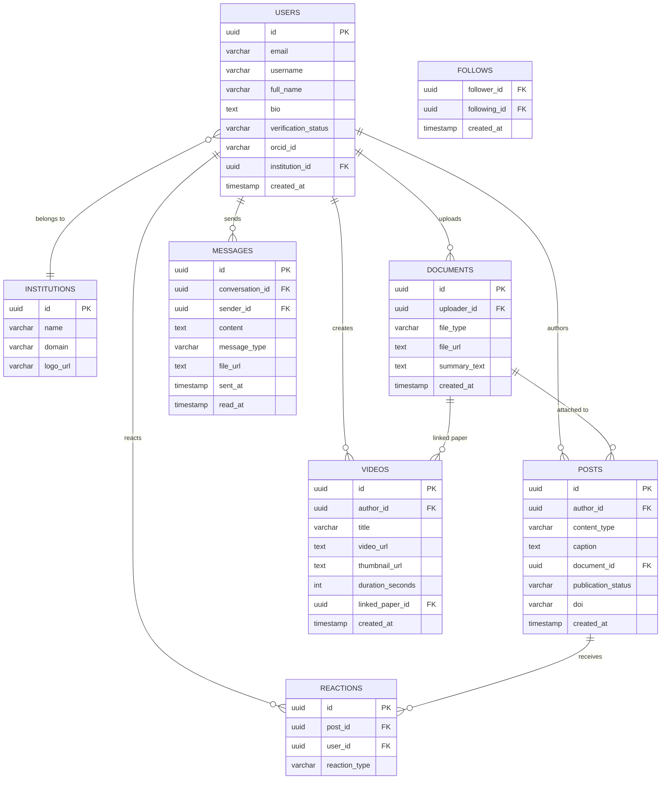
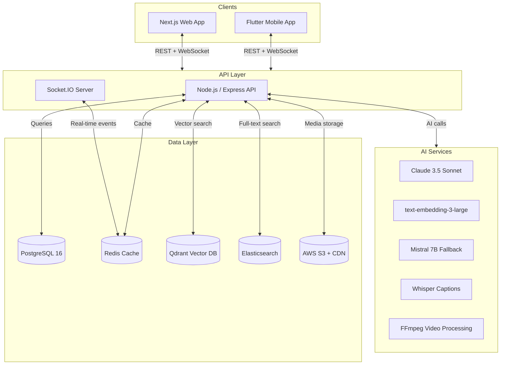

# ResearchReel — Data Flow Diagrams

> Derived from **ResearchReel_SRS_v1.0 (April 2, 2026)**
>
> See also: `docs/architecture.md` for the project-level architecture blueprint and component mapping.

---

## DFD Level 0 — System Context Diagram

---

## DFD Level 1 — Major Subsystems

---

## DFD Level 2 — Authentication and Verification Flow

---

## DFD Level 2 — Video Upload and Processing Pipeline

---

## DFD Level 2 — AI Document Q&A RAG Pipeline

---

## DFD Level 2 — Feed Generation and Recommendation

---

## DFD Level 2 — Real-Time Messaging Socket.IO

---

## DFD Level 2 — Content Moderation Pipeline

---

## Database Entity Relationship Overview

---

## Infrastructure Architecture

