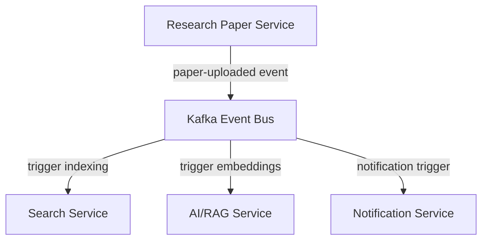
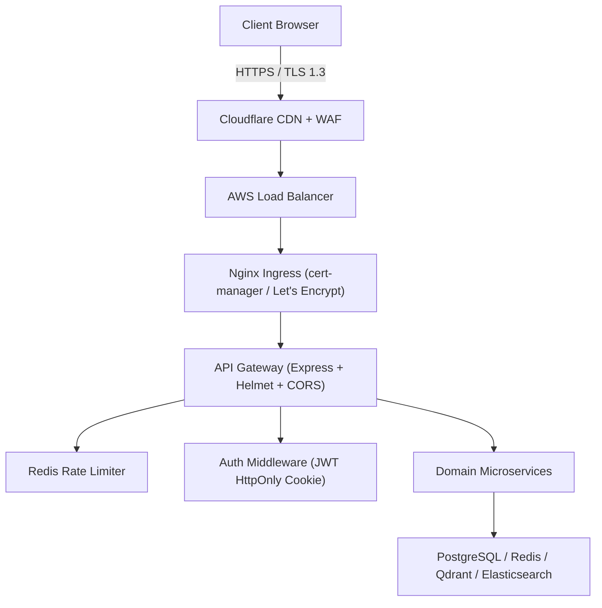

# ResearchReel — Software Architecture Document (SAD)

This document provides a comprehensive overview of the system architecture, design decisions, data-flow boundaries, and service organization for **ResearchReel**, a cloud-native, microservice-based research-centric social platform built to scale to **1M+ researchers, professors, and students**.

---

## Architecture Principles

The following principles guide every design, infrastructure, and implementation decision made across the ResearchReel platform:

| # | Principle | Description |
| :---: | :--- | :--- |
| 1 | **API-first design** | Every feature is exposed through a well-defined, versioned API contract before any UI is built. |
| 2 | **Microservice architecture** | The domain is split into small, independently deployable services with clear bounded contexts. |
| 3 | **Event-driven communication** | Services communicate asynchronously via Apache Kafka topics to remain loosely coupled and resilient. |
| 4 | **Stateless services** | All application-layer services are stateless; session and cache state is externalised to Redis. |
| 5 | **Horizontal scalability** | Every service is designed to scale out by adding replicas, not by scaling up a single node. |
| 6 | **Security by design** | Authentication, authorisation, secrets management, and network controls are built in — not bolted on. |
| 7 | **Observability-first** | Structured logging, Prometheus metrics, distributed tracing, and health endpoints are non-negotiable. |
| 8 | **AI as an independent service** | The AI/RAG capability is isolated in its own service with its own datastore (Qdrant) and scaling profile. |
| 9 | **Database per bounded context** | Each microservice owns its own datastore; cross-service data access goes through APIs, not shared tables. |

---

## 1. High-Level Architecture

ResearchReel uses a decoupled, event-driven microservices architecture. The system is designed to handle high-concurrency client connections by routing API calls through a secure front-facing Gateway, separating core logic into domain-driven microservices, and delegating asynchronous jobs to specialized worker pipelines.

### 1.1 Logical Infrastructure Topography

```text
               Client
                  │
            HTTPS Requests
                  │
             API Gateway
                  │
      ┌───────────┼────────────┐
      │           │            │
 Authentication  Feed      Messaging
      │           │            │
      └───────────┼────────────┘
                  │
             PostgreSQL
                  │
Redis    Elasticsearch    Qdrant
                  │
                S3
                  │
             AI Service
```

### 1.2 Enterprise Service Topography

```text
                                 INTERNET
                                     |
                               Cloudflare CDN
                                     |
                               Load Balancer
                                     |
                              Nginx API Gateway
                                     |
      ---------------------------------------------------------------------------------
      |           |            |            |            |            |               |
    Auth        User        Research      Reel         Video          AI            Citation
   Service     Service      Paper Svc    Service     Processing     Service       Intelligence
      |           |            |            |            |            |               |
   PostgreSQL  PostgreSQL   PostgreSQL   PostgreSQL    FFmpeg       Qdrant          Neo4j
    + Redis                  + S3         + S3        GPU Workers  Vector DB       Graph DB
      |           |            |            |            |            |               |
      ---------------------------------------------------------------------------------
                                     |
                               Event Bus (Kafka)
                                     |
      ---------------------------------------------------------------------------------
      |           |            |            |            |            |               |
   Recommend.   Search      Workspace      Chat       Social    Notification     Leaderboard
    Service    Service       Service      Service      Graph       Service         Service
      |           |            |            |            |            |               |
   Redis +    Elasticsearch  MongoDB      MongoDB      Neo4j       Redis +         Redis +
   Cassandra                                          Graph DB     Nodemailer      PostgreSQL
      |           |            |            |            |            |               |
      ---------------------------------------------------------------------------------
                                     |
                             Analytics Service
                                     |
                             Kafka + ClickHouse
```

---

## 2. Microservice Boundaries & Responsibilities

The domain is split into discrete services that communicate either via synchronous HTTP/WebSockets or asynchronously using Apache Kafka.

### 2.1 Front-Facing Gateway
* **API Gateway**: Acts as the reverse proxy for all client applications. It performs JWT signature validation, CORS headers enforcement, and rate-limiting using a Redis database backend.

### 2.2 Domain Microservices
1. **Authentication Service**
   * *Domain*: User identity management, registration, credential security, role management, and session control.
   * *Datastores*: PostgreSQL (`auth_db`) for user schemas; Redis for transient email OTP codes.
2. **User Profile Service**
   * *Domain*: Academic credentials, researcher profiles, user biography, interests, and affiliations.
   * *Datastore*: PostgreSQL (`user_profile_db`).
3. **Research Paper Service**
   * *Domain*: PDF/document uploads, revision/version histories, publication DOI validation, and document metadata extraction.
   * *Datastores*: PostgreSQL (`paper_db`) for document index metadata; AWS S3 for binary PDF artifacts.
4. **Reel Service**
   * *Domain*: Vertical micro-videos (30-60 seconds), captions, viewing statistics, likes, and comment streams.
   * *Datastores*: PostgreSQL (`reel_db`) and AWS S3/Cloudflare CDN.
5. **Video Processing Service**
   * *Domain*: CPU/GPU-intensive transcoding to multi-bitrate HLS formats, thumbnail generation, and Whisper auto-captioning.
   * *Workers*: Python workers using FFmpeg bindings.
6. **AI/RAG Service**
   * *Domain*: Deep document parsing, recursive text chunking, vector embedding generation, and contextual Retrieval-Augmented Generation (RAG) chat answers.
   * *Datastore*: Qdrant Vector Database.
7. **Citation Intelligence Service**
   * *Domain*: Academic citations network representation. Flags citations supporting, contradicting, or neutral to previous papers.
   * *Datastore*: Neo4j Graph DB.
8. **Recommendation Service**
   * *Domain*: Custom feed ranking algorithms based on user telemetry and interest categories.
   * *Datastores*: Redis for recommendation caches; Cassandra for persistent clickstreams.
9. **Search Service**
   * *Domain*: Inverted index searches for high-speed keywords matching across papers, authors, and universities.
   * *Datastore*: Elasticsearch.
10. **Workspace Service**
    * *Domain*: Collaborative workspace environments supporting LaTeX rendering, project boards, and collaborative annotations.
    * *Datastore*: MongoDB (dynamic document storage).
11. **Chat Service**
    * *Domain*: Real-time peer-to-peer and group chat rooms, utilizing WebSockets for low-latency transmission.
    * *Datastore*: MongoDB for persistent chat history; Redis for Socket.IO pub/sub brokers.
12. **Social Graph Service**
    * *Domain*: Mentorship relationships, academic networks, following connections, and co-author nodes.
    * *Datastore*: Neo4j.
13. **Notification Service**
    * *Domain*: Push notifications, email digests, SMS alerts. Uses BullMQ for reliable execution.
14. **Leaderboard Service**
    * *Domain*: Dynamic statistics tracking trending papers, top institutions, and reviewer scores.
    * *Datastore*: Redis Sorted Sets.
15. **Analytics Service**
    * *Domain*: High-throughput clickstream data, watch time, and retention telemetry ingestion.
    * *Datastore*: ClickHouse.

---

## 3. Storage Topology & Rationale

| Storage Engine | Primary Microservices | Rationale |
| :--- | :--- | :--- |
| **PostgreSQL** | Auth, Profile, Paper, Reel | Demands ACID compliance, highly structured relational tables. |
| **MongoDB** | Workspace, Chat | Unstructured documents, hierarchical project trees, rapid writes. |
| **Neo4j** | Citation, Social Graph | Relational graph queries, multi-hop path traversals. |
| **Elasticsearch** | Search Service | Full-text query support, inverted indexing, synonym matching. |
| **Qdrant** | AI/RAG Service | Fast high-dimensional vector similarity indexing (Cosine/L2 distance). |
| **Cassandra** | Recommendation | Massive write capability for event history tracking. |
| **ClickHouse** | Analytics | Columnar engine ideal for OLAP aggregations. |
| **Redis** | Gateway, Leaderboard, Caching | Sub-millisecond read/writes for sessions, rate limits, queues. |

---

## 4. Communication Architecture

### 4.1 Synchronous Communication
* **REST APIs**: Clients interact with the API Gateway, which forwards requests to services using internal gRPC or HTTP REST endpoints.
* **WebSockets**: Utilized by the Chat and Workspace services for real-time state synchronization.

### 4.2 Asynchronous Event Bus (Kafka Topics)



* **`user-registered`**: Produced by Auth Service to initialize profiles and send welcome emails.
* **`paper-uploaded`**: Triggered when a new PDF is parsed; consumed by AI/RAG, Search, and Notification services.
* **`reel-uploaded` / `video-processed`**: Handles the asynchronous transition between raw video uploads, FFmpeg processing, and final feed availability.

---

## 5. Deployment Architecture

ResearchReel is containerized and orchestrated exclusively using Kubernetes. Each microservice runs as an independent container image, deployed to AWS EKS (Elastic Kubernetes Service).

### 5.1 Container Strategy

Every service follows a **multi-stage Docker build** pattern to minimize image size and attack surface:

```dockerfile
# Stage 1 — Install dependencies
FROM node:18-alpine AS deps
WORKDIR /app
COPY package*.json ./
RUN npm ci --only=production

# Stage 2 — Runtime image (no dev tools, no build cache)
FROM node:18-alpine AS runner
WORKDIR /app
COPY --from=deps /app/node_modules ./node_modules
COPY src ./src
CMD ["node", "src/server.js"]
```

### 5.2 Kubernetes Namespace Layout

All resources are deployed into a dedicated `researchreel` namespace for isolation and resource governance:

| Resource Type | Manifest File |
| :--- | :--- |
| **Secrets** | `k8s/secrets.yml` |
| **ConfigMap** | `k8s/microservices-deployments.yml` |
| **Microservice Deployments** | `k8s/microservices-deployments.yml` |
| **API Gateway** | `k8s/gateway-deployment.yml` |
| **Video Worker** | `k8s/worker-deployment.yml` |
| **RAG Service** | `k8s/rag-deployment.yml` |
| **Frontend (Next.js)** | `k8s/frontend-deployment.yml` |
| **Ingress (Nginx + TLS)** | `k8s/ingress.yml` |
| **Horizontal Pod Autoscalers** | `k8s/hpa.yml` |

### 5.3 CI/CD Pipeline

Automated deployments are triggered via **GitHub Actions** (`.github/workflows/deploy.yml`) on every push to `main`:

```text
Git Push (main)
      ↓
audit-and-test job
  ├── npm ci (backend + frontend)
  ├── npm audit --audit-level=high
  ├── npm run lint (frontend)
  ├── npm run build (frontend)
  └── npm test (backend Jest suite)
      ↓
build-and-push job (on main only)
  ├── Build: api-gateway image → GHCR
  ├── Build: video-worker image → GHCR
  ├── Build: rag-service image → GHCR
  └── Build: frontend image → GHCR
      ↓
deploy-to-kubernetes job
  ├── kubectl apply -f k8s/ (all manifests)
  └── kubectl set image (rolling update with new SHA tag)
```

---

## 6. Scalability Strategy

### 6.1 Horizontal Pod Autoscaling (HPA)

All stateless microservices are governed by `HorizontalPodAutoscaler` objects defined in `k8s/hpa.yml`. Kubernetes automatically adjusts replica counts based on observed CPU and memory utilization:

| Service | Min Replicas | Max Replicas | CPU Trigger | Memory Trigger |
| :--- | :---: | :---: | :---: | :---: |
| API Gateway | 2 | 10 | 70% | 80% |
| Auth Service | 2 | 8 | 70% | 80% |
| Research Paper Service | 2 | 8 | 70% | 80% |
| Reel Service | 2 | 10 | 70% | 80% |
| Video Worker | 2 | 12 | 65% | 75% |
| AI / RAG Service | 2 | 8 | 65% | 75% |
| Search Service | 2 | 8 | 70% | 80% |
| Chat Service | 2 | 8 | 70% | 80% |
| Recommendation Service | 2 | 8 | 70% | 80% |
| Notification Service | 2 | 6 | 70% | 80% |
| Analytics Service | 2 | 6 | 70% | 80% |
| Frontend (Next.js) | 2 | 10 | 70% | 80% |

> **Note:** The Video Worker and AI/RAG Service have lower CPU/memory thresholds (65%/75%) because FFmpeg transcoding and embedding generation are burst-heavy workloads. Early scale-out prevents queue backpressure.

### 6.2 Database Scaling Strategy

Stateful databases are **not** managed by HPA. Each uses its native scaling mechanism:

* **PostgreSQL**: Primary-Replica cluster with PgBouncer connection pooling. Read replicas absorb heavy `SELECT` load from feed and profile queries.
* **Redis**: Multi-AZ cluster mode — shards distributed across three availability zones.
* **Elasticsearch**: Index sharding strategy with dedicated data and master nodes.
* **Qdrant**: Horizontal collection sharding for high-dimensional vector partitioning.
* **Kafka**: Partition-level parallelism across topic brokers — each consumer group service scales consumers with replicas.

### 6.3 Target Scale Objectives

The system architecture is designed to support horizontal scaling toward the following targets:

| Metric | Target |
| :--- | :--- |
| Peak Concurrent Users | 100,000 |
| Total Registered Users | 1,000,000+ |
| API Gateway Throughput | ≥ 5,000 req/sec |
| Feed Generation Latency | < 100 ms (p95) |
| Search Latency | < 100 ms (p95) |
| Video Transcoding Queue Drain | < 60 sec per reel |

---

## 7. Security Architecture

Security is enforced in-depth across all network, application, and data layers.

### 7.1 Network Security



### 7.2 Application Security Controls

| Control | Implementation | Location |
| :--- | :--- | :--- |
| **Helmet Headers** | CSP, HSTS, X-Frame-Options, X-Content-Type | `backend/src/app.js` |
| **CORS Policy** | Origin restricted to `FRONTEND_URL` env var | `backend/src/app.js` |
| **Rate Limiting** | Redis-backed atomic counters (1,000 req/15 min) | `backend/src/middleware/rateLimiter.js` |
| **JWT Authentication** | HttpOnly SameSite cookie; Bearer token fallback | `backend/src/middleware/authMiddleware.js` |
| **Password Hashing** | Argon2id (PHC winner; GPU-resistant) | `backend/src/services/authService.js` |
| **SQL Injection** | Parameterized queries via `pg` client | All repository modules |
| **Input Validation** | Email regex, length constraints, type checks | `backend/src/controllers/authController.js` |
| **XSS Prevention** | Helmet CSP headers; client-side output encoding | App-level |
| **Secrets Management** | Kubernetes Secrets with `secretKeyRef` injection | `k8s/secrets.yml` |

### 7.3 Secrets Management

No credentials are stored in environment files, ConfigMaps, or container image layers. All sensitive variables are injected at runtime via Kubernetes Secrets:

```yaml
# k8s/secrets.yml (base64-encoded values)
apiVersion: v1
kind: Secret
metadata:
  name: researchreel-secrets
type: Opaque
data:
  postgres-password: <base64>
  jwt-secret: <base64>
  gemini-api-key: <base64>
  qdrant-api-key: <base64>
  neo4j-password: <base64>
```

---

## 8. Observability

### 8.1 Logging Stack

| Layer | Tool | Format |
| :--- | :--- | :--- |
| Application Logs | Winston | Structured JSON → `stdout` |
| HTTP Access Logs | Morgan | Combined format → `stdout` |
| Container Logs | `kubectl logs` / Fluentbit | Forwarded to ELK / CloudWatch |
| Error Tracking | Error middleware → APM hook | Sentry / AWS CloudWatch |

**Example production Winston JSON log:**
```json
{"message":"[Rate Limit Exceeded] IP: ::ffff:127.0.0.1, Path: /api/posts/upload","level":"warn","timestamp":"2026-06-26T11:24:00.321Z"}
```

### 8.2 Metrics & Monitoring

* **Prometheus**: Scrapes Express duration histograms, error rates, and Node.js GC metrics via `prom-client`.
* **Node Exporter**: Collects host-level disk I/O, RAM, and network metrics from each EKS node.
* **Kube-State-Metrics**: Exposes pod lifecycle states, replica availability, and node allocation to Prometheus.
* **Grafana Dashboards**: Visualizes API latency distributions, pod CPU/memory utilization, database connection pool usage, and Kafka consumer lag.

### 8.3 Health Endpoints

The `/api/health` endpoint is the single source of truth for system liveness and is checked by:
* **Kubernetes Liveness Probe** — auto-restarts failing pods.
* **Kubernetes Readiness Probe** — gates traffic until all dependencies report healthy.
* **CI/CD Pipeline** — queries `/api/health` post-deploy to confirm rollout stability.

**Health check dependencies checked at runtime:**

| Dependency | Check Method | Timeout |
| :--- | :--- | :---: |
| PostgreSQL | `SELECT 1` query | 2 sec |
| Redis | `PING` command | 1 sec |
| Elasticsearch | `/_cluster/health` GET | 3 sec |
| RAG Service | `/api/ai/health` GET | 3 sec |
| System | OS uptime, heap, CPU load | — |
